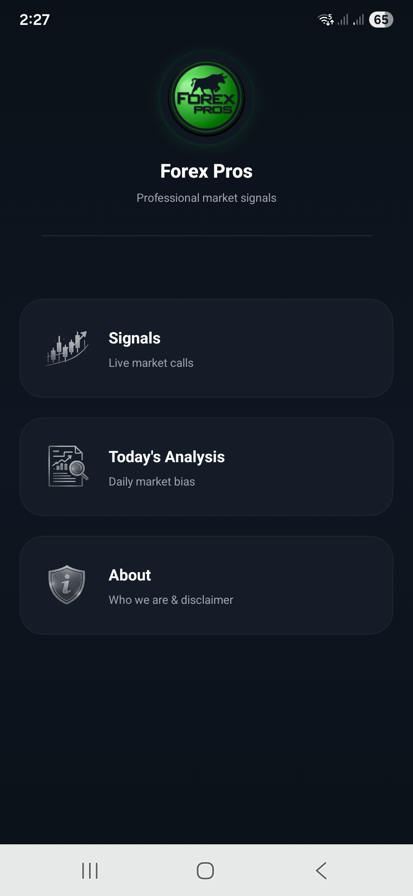
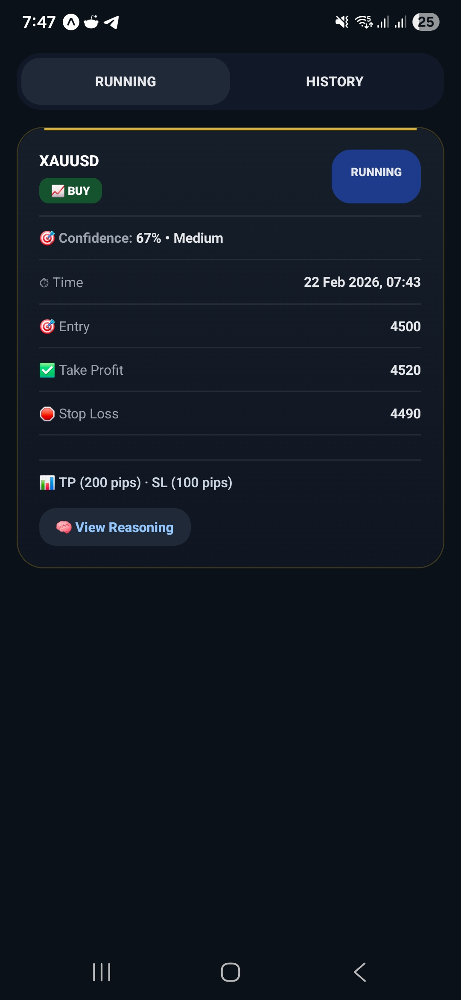
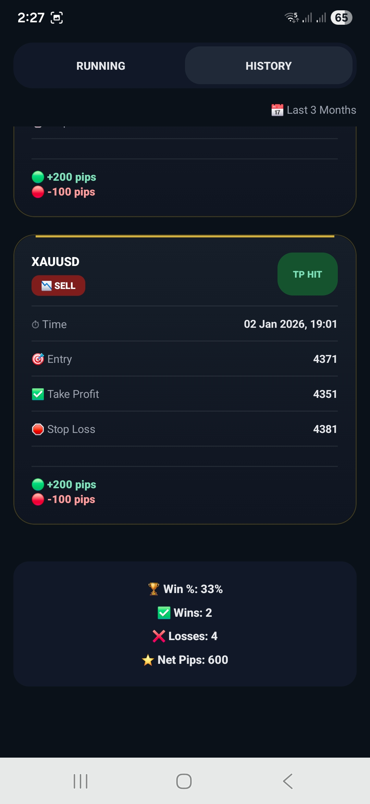
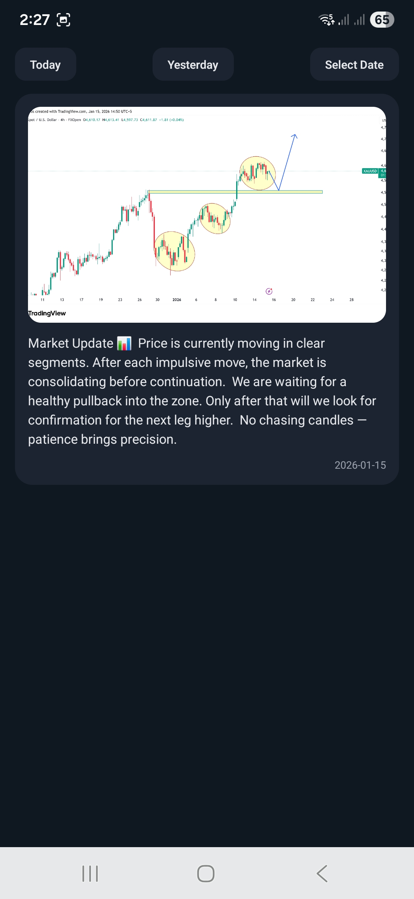
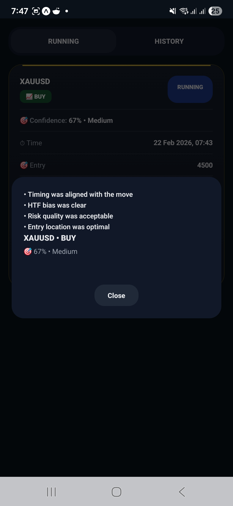

# Alpha Mobile App

Professional mobile application built using React Native, Expo, and Firebase for real-time signal delivery and user interaction.

This project demonstrates full-stack mobile development skills including frontend UI, Firebase backend integration, and real-time data handling.

---

## Features

• Real-time signal delivery using Firebase Firestore  
• Modern mobile UI built with React Native and Expo  
• Secure Firebase backend integration  
• Modular architecture with reusable components  
• Scalable project structure suitable for production apps  

---
## 📱 App Screenshots

### 🏠 Home

### 📊 Running

### 📜 History

### 📈 Analysis

### 🔔 Popup

---

## Tech Stack

• React Native  
• Expo  
• Firebase (Firestore, Authentication, Cloud Functions)  
• JavaScript  
• Node.js (Firebase Functions)  

---

## Project Structure

assets/        → Images and static resources  
screens/       → App screens and UI logic  
navigation/    → Navigation configuration  
utils/         → Helper functions  
functions/     → Firebase cloud functions  
App.js         → Main application entry point  

---

## How to Run

1) Clone repository

git clone https://github.com/huzaifahintisar2/alpha-mobile-app.git

2) Install dependencies

npm install

3) Start Expo server

npx expo start

---

## Purpose

This project was built to demonstrate professional mobile development skills and backend integration using Firebase, suitable for real-world production applications.

---

## Author

Huzaifah  
Software Engineer  
Incoming Master's Student – Automotive Software Engineering, Germany
